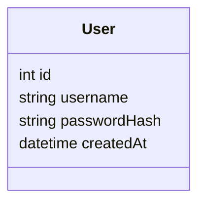
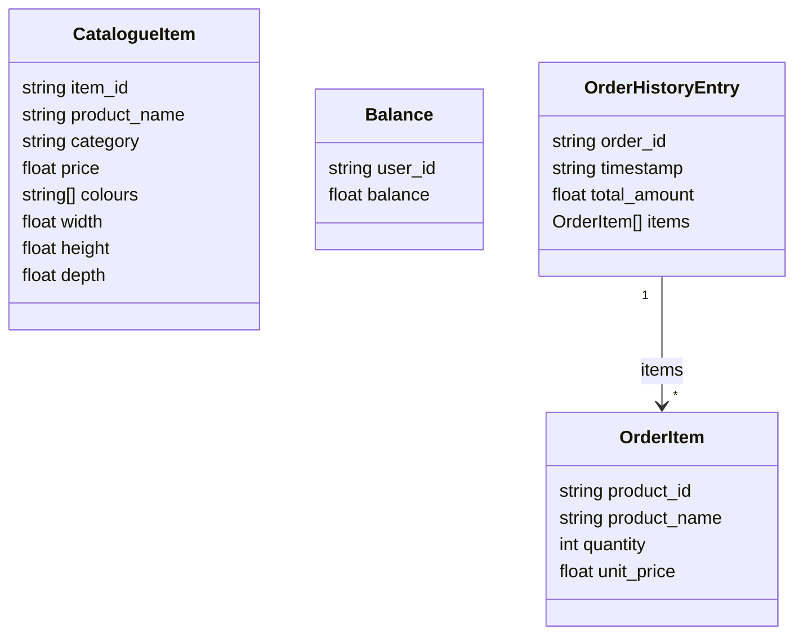

# Data Model

## What we store ourselves

Only one thing: login accounts.

- **User** — a buyer who can log into this app. Stores their login username and a securely hashed password (never the plain password). That's it — no budget field, because balance now comes live from the real furniture shop API (see below).

## What comes live from the furniture shop API instead

The catalogue, this participant's real balance, and real order history are never stored in our own database — every page that needs them calls the furniture shop's API directly (`src/lib/productApi.js`) each time. This is a genuine external, real-money(-for-the-event) service, not test data.

- **CatalogueItem** — one furniture product, fetched from `GET /catalogue/search-index`. Our catalogue page fetches the full list once per request and does its own search/pagination over it in memory, since that endpoint only supports an exact category filter, not free-text search. Product photos aren't fetched into this list at all — each `` points straight at `GET /catalogue/{item_id}/image`.
- **Balance** — this participant's real remaining balance, fetched from `GET /users/{user_id}` and shown on the home page.
- **OrderHistoryEntry** — a real past order, fetched from `GET /orders/{user_id}` for the "My Orders" page. Each order can contain more than one item, so the page flattens `items` into one table row per item.

## Placing a real order

Clicking "Buy" calls our own `POST /api/orders`, which calls the shop API's `POST /orders` (debiting the real balance) and returns its response straight through — no local record is kept, since order history is now read live from the shop API too.

The shop API is the single source of truth for whether an order can be afforded: if it would exceed the real balance, the API itself rejects it (`402`), and that's surfaced directly as an error message rather than our app pre-checking a budget.

**One limitation worth knowing:** the shop API is scoped to a single participant identity (`PRODUCT_API_USER` / `PRODUCT_API_KEY` in `.env`), not per-login-account. Every user who logs into this app and buys something is spending against the same shared real balance and appears in the same shared order history — there's no way to separate that per local account with this API.
