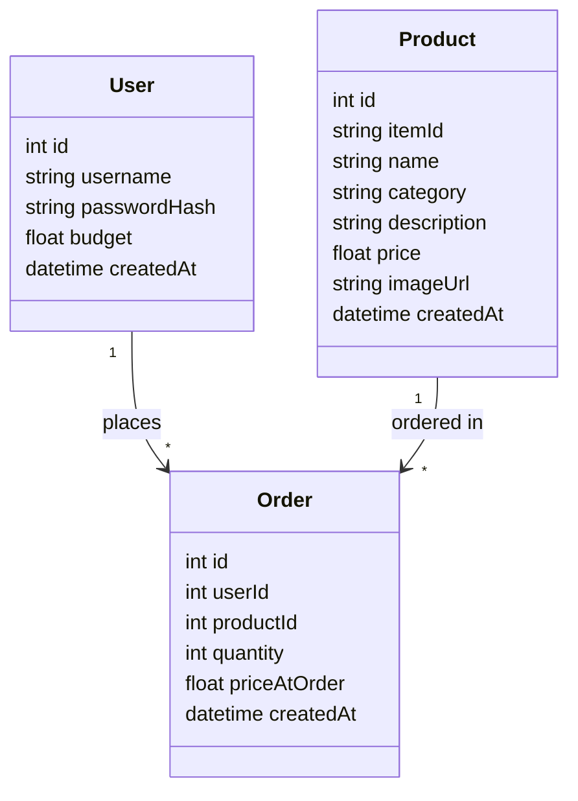

# Data Model



## In plain English

There are three things the app needs to remember:

- **User** — a buyer. Stores their login username, a securely hashed password (never the plain password), and their budget — the total amount of money they're allowed to spend.
- **Product** — a furniture item in the catalogue, sourced from the furniture shop's own catalogue API. Stores its `itemId` (the API's own product ID, used to keep our copy in sync), name, category, description, price, and a photo.
- **Order** — a record of one buyer ordering one product. Each order stores who placed it, which product, how many, and the price of that product *at the time of ordering* (`priceAtOrder`).

## How they connect

- One **User** can place many **Orders** (but each Order belongs to exactly one User).
- One **Product** can appear in many **Orders** (but each Order is for exactly one Product).
- There's no separate "shopping cart" or multi-item order — placing an order is a single action: pick a product, pick a quantity, order it. That keeps the flow simple: browse the catalogue, click order, see your budget update.

## Why store `priceAtOrder` instead of just looking up the product's current price?

If a product's price ever changes after someone has already ordered it, we don't want that to retroactively change what past orders "cost" — that would make budget totals shift for no reason the buyer did. Snapshotting the price at order time keeps past orders and budget history stable.

## Calculating remaining budget

```
remaining budget = user.budget − sum(order.priceAtOrder × order.quantity) for all of that user's orders
```
